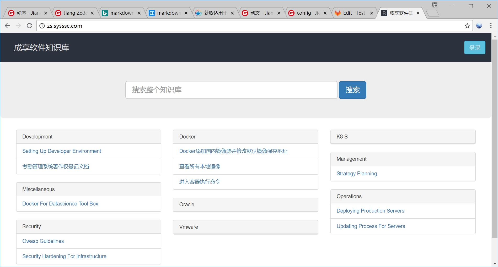

### 公司做了这么多年，所有的经验都在工程师脑子里面，工程师一走，啥都没剩下。所以我们需要搭建公司的知识系统，把平时点点滴滴的小经验积累起来，将来就是公司的专家系统，成为公司的财富。
### 找了一圈发现各种wiki都好复杂，还要学习wiki语法，找到这个Raneto，轻量简便还支持全文搜索。我们以CentOS 7.5为例，讲解如何搭建自己的知识系统。

### 1.安装docker及docker-compose
#### 1.1卸载旧版本
```
$ sudo yum remove docker \
                  docker-common \
                  docker-selinux \
                  docker-engine
```
#### 1.2安装所需的软件包
```
$ sudo yum install -y yum-utils device-mapper-persistent-data lvm2
```
#### 1.3设置stable镜像仓库
```
$ sudo yum-config-manager \
       --add-repo \
       https://download.docker.com/linux/centos/docker-ce.repo
```
#### 1.4更新软件包索引
```
$ sudo yum makecache fast
```
#### 1.5安装最新版本的 Docker CE
```
$ sudo yum install docker-ce
```
#### 1.6设置国内镜像源并修改镜像默认保存地址
修改 /etc/docker/daemon.json 文件并添加上 registry-mirrors 键值。  
```
{
  "registry-mirrors": ["https://registry.docker-cn.com"],"graph": "/data/docker"
}
```
修改保存后重启 Docker 以使配置生效。  
```
$ sudo systemctl restart docker
```
#### 1.7安装docker-compose

```
sudo curl -L "https://github.com/docker/compose/releases/download/1.23.1/docker-compose-$(uname -s)-$(uname -m)" -o /usr/local/bin/docker-compose
sudo chmod +x /usr/local/bin/docker-compose
```

### 2.创建图片保存目录(默认我放在/data/www/media下面，如果放在其他目录请修改config/config.default.js文件)。   
```
$ mkdir -p /data/www/media
```
### 3.克隆raneto-docker项目。  

```
$ cd /data  
$ git clone https://gitee.com/39627020/raneto-docker.git  
$ cd raneto-docker 
```

### 4.执行docker-compose，构建知识库系统。
'$ docker-compose up -d --build'
### 5.这个系统不需要DB支持，直接扫描content目录下的markdown文件。所以上传知识库的时候直接将
### 6.完成后类似如下的效果
